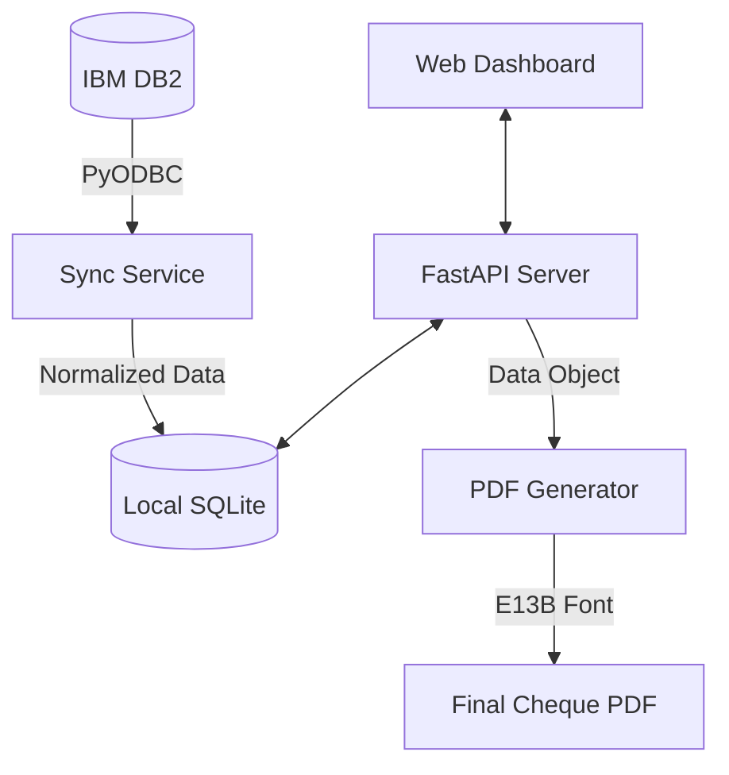

# ChequeFlow | Pension Cheque Generation System

ChequeFlow is a sophisticated, bank-grade cheque generation and management system designed specifically for pension funds. It automates the process of synchronizing claim and pension data from IBM DB2 environments, applying complex formatting rules, and generating high-fidelity PDF cheques with a integrated digital signature approval workflow.

## Table of Contents
- [Features](#features)
- [Architecture](#architecture)
- [Installation](#installation)
- [Usage](#usage)
- [Repository Structure](#repository-structure)
- [Core Technologies](#core-technologies)

---

## Features

- **IBM DB2 Multi-Source Synchronization**: Seamlessly pulls data from multiple DB2 environments (supporting "Plasters" and "J84" datasets) with optimized fetching and local caching.
- **Professional PDF Generation**: Generates high-resolution, black-themed cheques using the `ReportLab` engine, featuring precise element positioning and custom font support.
- **Dynamic Bank Enrichment**: Transparently fetches routing fractions (`BKROUT`) and void periods (`BKVOID`) directly from the bank data to ensure layout accuracy.
- **Digital Signature Workflow**: Includes a signature management system that handles transparency (alpha channel) and auto-cropping for professional overlays.
- **Advanced Dashboard**: A responsive modern interface for reviewing, filtering (Cheque #, Payee, SSN, Date), and bulk-approving cheques.
- **MICR Support**: Full implementation of the E-13B MICR font for bank processing compatibility.
- **Intelligent Padding**: Automatically pads cheque numbers to a standard 8-digit format (`00123456`).

---

## Architecture

ChequeFlow follows a modular, service-oriented architecture designed for reliability and ease of maintenance.

### Data Flow
1. **Synchronization Layer**: The `sync_db2.py` module establishes a `pyodbc` connection to IBM DB2, fetches raw data from claims tables, and enriches it with bank metadata from `ameriben.bankfile`.
2. **Persistence Layer**: Data is normalized and stored in a local `SQLite` database (`cheques.db`), allowing for high-performance dashboard interactions and offline record review.
3. **Application Layer**: A `FastAPI` web server provides RESTful APIs for the dashboard and signature management.
4. **Generation Engine**: The `ChequeGenerator` class receives data objects and produces exact-coordinate PDFs using specialized assets and fonts.

### Visual Architecture


---

## Installation

### Prerequisites
- **Python 3.9+**
- **IBM iSeries Access ODBC Driver**: Required to communicate with DB2.
- **Git**

### Step-by-Step Setup

1. **Clone the Repository**
   ```bash
   git clone https://github.com/Rushi-04/ChequeFlowV2.git
   cd ChequeFlowV2
   ```

2. **Set up Virtual Environment**
   ```bash
   python -m venv venv
   source venv/bin/activate  # On Windows: venv\Scripts\activate
   ```

3. **Install Dependencies**
   ```bash
   pip install -r requirements.txt
   ```

4. **Environment Configuration**
   Create a `.env` file in the root directory and populate it with your DB2 credentials:
   ```env
   DB2_HOST=your_host_address
   DB2_PORT=your_port
   DB2_DATABASE=your_database_name
   DB2_USER=your_username
   DB2_PASSWORD=your_password
   ```

---

## Usage

### 1. Initialize Database
Before the first run, initialize the local SQLite schema and migration tables:
```bash
python src/db_init.py
```

### 2. Start the Server
Launch the application server:
```bash
python src/app.py
```
Open your browser to `http://localhost:8000`.

### 3. Synchronize Records
- Select your source (e.g., **Plasters**) from the header dropdown.
- Click **Sync Data** to pull latest records from DB2.
- Use the advanced filters to find specific records by **Cheque Number**, **Payee**, or **SSN**.

---

## Repository Structure

```text
ChequeFlowV2/
├── src/
│   ├── app.py              # FastAPI Web ApplicationEntry Point
│   ├── sync_db2.py         # DB2 Extraction and Transformation Logic
│   ├── db_init.py          # Database Schema & Migration Manager
│   ├── cheque_generator.py # Core PDF Rendering Engine
│   ├── services/           # Business Logic Layer (Sqlite, Sync, etc.)
│   └── templates/          # Modern Dashboard UI (HTML/CSS/JS)
├── assets/
│   ├── fonts/              # E13B/MICR & TTF Assets
│   ├── signatures/         # Digital Signature Workspace
│   └── templates/          # Overlay Backgrounds (Top advice & Cheque BG)
├── outputs/                # Generated Cheque PDF Repository
├── .env                    # Environment Configuration (Git-Ignored)
├── requirements.txt        # Python Dependency Manifest
└── cheques.db              # Local Cache Persistence (Initialized via db_init)
```

---

## Core Technologies

- **Backend**: Python, FastAPI, Uvicorn
- **PDF Engine**: ReportLab
- **Database**: SQLite (Local), IBM DB2 (Remote)
- **Image Processing**: Pillow (PIL)
- **Connectivity**: PyODBC
- **UI Architecture**: Vanilla JS, Inter/JetBrains Typefaces, Ionicons
